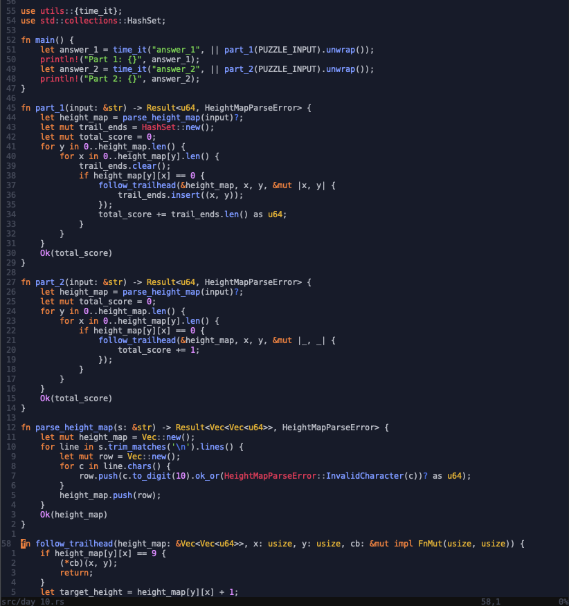
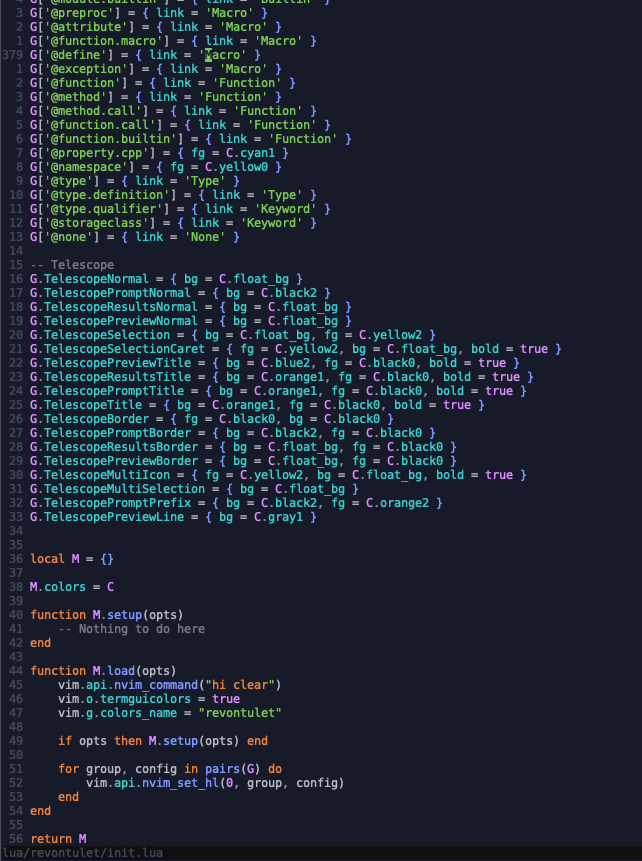
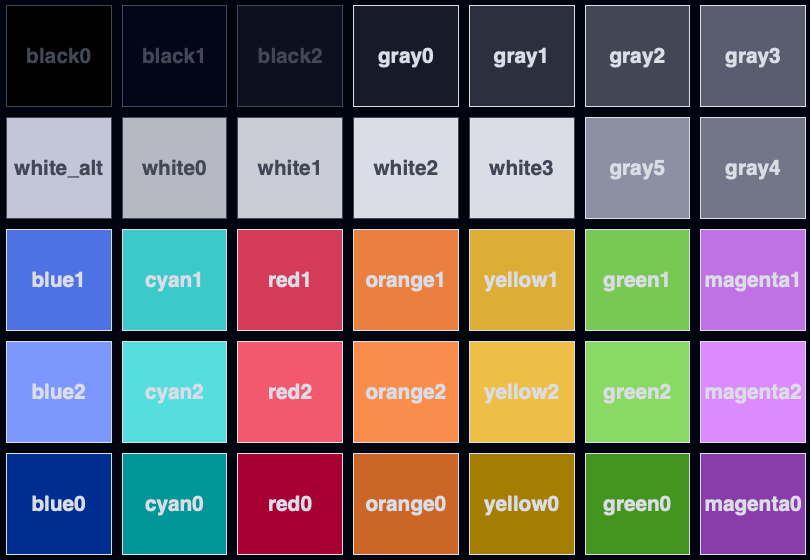

# revontulet.nvim

A dark but vibrant color scheme for neovim inspired by the northern lights. All the colors are derived from various images of the aurora borealis (revontulet in Finnish) with some hand-picked adjustments or sometimes complete hue shifts to provide a wider swatch of colors. The intent is to provide a visually pleasing and vibrant dark color scheme with a good contrast ratio.

# 📷 Showcase





# 🎨 Palette



# 📦 Installation

With [vim-plug](https://github.com/junegunn/vim-plug):

```vim
Plug `jussi-kalliokoski/revontulet.nvim`
```

# 🚀 Usage

```vim
colorscheme revontulet
```
